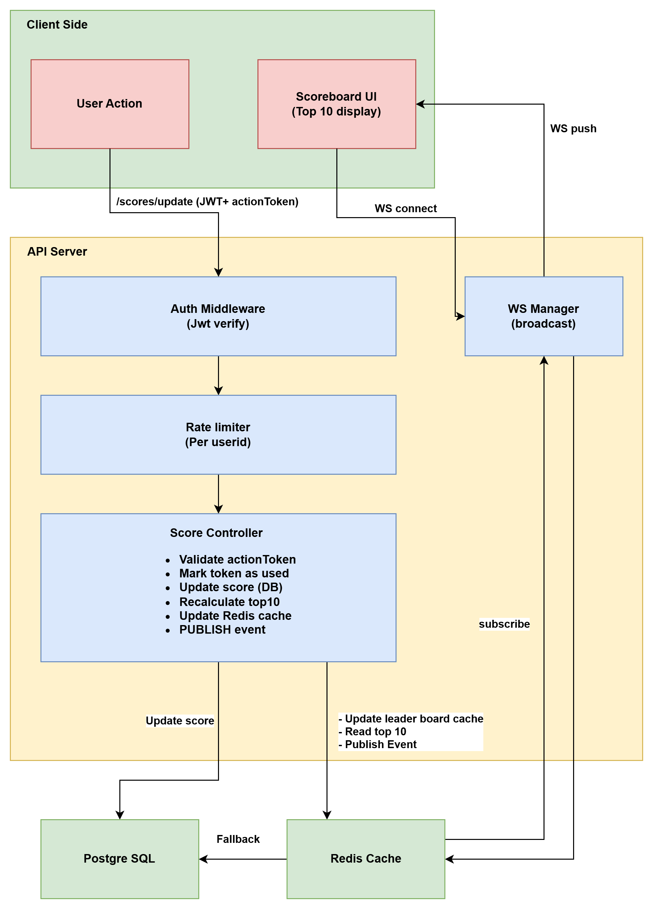
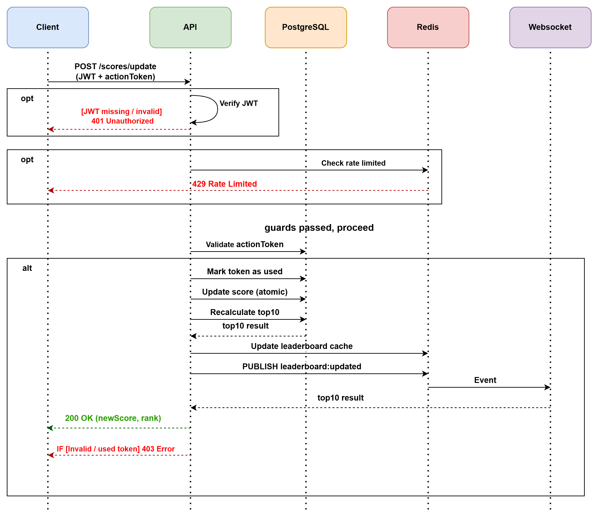

# Scoreboard API Module — Technical Specification

> **Module:** Live Scoreboard & Score Update Service

---

## Table of Contents

1. [Overview](#1-overview)
2. [System Architecture](#2-system-architecture)
3. [Sequence Diagrams](#3-sequence-diagrams)
4. [Technology Stack](#4-technology-stack)
5. [Data Models](#5-data-models)
6. [API Endpoints](#6-api-endpoints)
7. [Authentication & Authorization](#7-authentication--authorization)
8. [Real-time Live Update](#8-real-time-live-update)
9. [Security & Anti-Cheat](#9-security--anti-cheat)
10. [Error Handling](#10-error-handling)
11. [Rate Limiting](#11-rate-limiting)
12. [Suggested Improvements](#12-suggested-improvements)

---

## 1. Overview

This module is responsible for:

- Accepting score update requests from clients after a user completes an action
- Maintaining a **Top 10 leaderboard** that reflects the latest scores
- Pushing **real-time updates** to all connected clients via WebSocket
- **Preventing unauthorized or malicious score manipulation**

### Scope

**In Scope**

- Score update API
- Top 10 leaderboard
- Real-time updates (WebSocket)
- Authentication & anti-cheat

**Out of Scope**

- Action implementation
- User management (login/register)
- Payment / admin features

---

## 2. System Architecture



---

## 3. Sequence Diagrams



---

## 4. Technology Stack

| Layer         | Technology                 | Reason                                 |
| ------------- | -------------------------- | -------------------------------------- |
| Runtime       | Node.js + TypeScript       | Type safety, async performance         |
| Framework     | Express.js                 | Lightweight, widely used               |
| Database      | PostgreSQL                 | Reliable relational storage for scores |
| Cache         | Redis                      | Fast leaderboard reads, pub/sub for WS |
| Real-time     | WebSocket (ws library)     | Low latency live updates               |
| Auth          | JWT (jsonwebtoken)         | Stateless, scalable authentication     |
| Rate Limiting | express-rate-limit + Redis | Prevent API abuse                      |

> **Note:** Redis serves dual purpose — caching the top 10 leaderboard AND acting as a pub/sub broker to fan-out WebSocket events across multiple server instances.

---

## 5. Data Models

### 5.1 Database Schema (PostgreSQL)

```sql
-- Users table (managed by auth service, referenced here)
CREATE TABLE users (
  id          UUID PRIMARY KEY DEFAULT gen_random_uuid(),
  username    VARCHAR(50) NOT NULL UNIQUE,
  created_at  TIMESTAMP DEFAULT NOW()
);

-- Scores table
CREATE TABLE scores (
  id          UUID PRIMARY KEY DEFAULT gen_random_uuid(),
  user_id     UUID NOT NULL REFERENCES users(id) ON DELETE CASCADE,
  score       BIGINT NOT NULL DEFAULT 0,
  updated_at  TIMESTAMP DEFAULT NOW(),
  UNIQUE(user_id)
);

-- Action log table (for audit & anti-cheat)
CREATE TABLE action_logs (
  id            UUID PRIMARY KEY DEFAULT gen_random_uuid(),
  user_id       UUID NOT NULL REFERENCES users(id),
  action_token  VARCHAR(255) NOT NULL UNIQUE,
  score_delta   INT NOT NULL,
  created_at    TIMESTAMP DEFAULT NOW()
);

-- Indexes
CREATE INDEX idx_scores_score ON scores(score DESC);
CREATE INDEX idx_action_logs_user_id ON action_logs(user_id);
CREATE INDEX idx_action_logs_action_token ON action_logs(action_token);
```

### 5.2 Redis Data Structures

```
Key: leaderboard:top10
Type: Sorted Set (ZREVRANGE)
TTL:  No expiry — invalidated on each score update

Key: ratelimit:{userId}
Type: String (counter)
TTL:  60 seconds (sliding window)
```

---

## 6. API Endpoints

### 6.1 Update Score

**`POST /api/v1/scores/update`**

Dispatched by the client after a user successfully completes an action.

**Headers:**

```
Authorization: Bearer <JWT_TOKEN>
Content-Type: application/json
```

**Request Body:**

```json
{
  "actionToken": "act_a1b2c3d4e5f6..."
}
```

| Field         | Type   | Required | Description                                                                     |
| ------------- | ------ | -------- | ------------------------------------------------------------------------------- |
| `actionToken` | string | Yes      | One-time token issued by the server when the action started. Proves legitimacy. |

**Success Response `200 OK`:**

```json
{
  "success": true,
  "newScore": 1250,
  "rank": 3
}
```

**Error Responses:**

| Status | Code                 | Cause                                   |
| ------ | -------------------- | --------------------------------------- |
| `400`  | `INVALID_TOKEN`      | `actionToken` is missing or malformed   |
| `401`  | `UNAUTHORIZED`       | JWT token missing or expired            |
| `403`  | `TOKEN_ALREADY_USED` | `actionToken` has already been consumed |
| `403`  | `TOKEN_EXPIRED`      | `actionToken` is older than TTL window  |
| `429`  | `RATE_LIMITED`       | Too many requests                       |
| `500`  | `INTERNAL_ERROR`     | Unexpected server error                 |

---

### 6.2 Get Top 10 Leaderboard

**`GET /api/v1/scores/leaderboard`**

Returns the current top 10 users by score. Public endpoint — no auth required. Reads from Redis cache; falls back to PostgreSQL on cache miss.

**Response `200 OK`:**

```json
{
  "leaderboard": [
    { "rank": 1, "userId": "uuid-...", "username": "alice", "score": 5000 },
    { "rank": 2, "userId": "uuid-...", "username": "bob", "score": 4800 }
  ],
  "updatedAt": "2024-01-15T10:30:00Z"
}
```

---

### 6.3 WebSocket — Live Leaderboard

**`WS /ws/scoreboard`**

Clients connect to receive real-time push updates whenever the leaderboard changes.

**Server → Client push event:**

```json
{
  "event": "LEADERBOARD_UPDATE",
  "data": {
    "leaderboard": [
      { "rank": 1, "userId": "...", "username": "alice", "score": 5100 }
    ],
    "updatedAt": "2024-01-15T10:30:05Z"
  }
}
```

**Keepalive — Client → Server / Server → Client:**

```json
{ "event": "PING" }
{ "event": "PONG" }
```

> No auth required for read-only leaderboard. See [Improvement 12.1](#121-authenticated-websocket-connections) for future hardening.

---

## 7. Authentication & Authorization

### 7.1 JWT Payload

```json
{
  "sub": "user-uuid-here",
  "username": "alice",
  "iat": 1705312200,
  "exp": 1705398600
}
```

### 7.2 Auth Middleware Flow

```
Incoming request
      │
      ▼
Extract Bearer token from Authorization header
      │
      ├── Missing?           ──► 401 UNAUTHORIZED
      ├── Invalid signature? ──► 401 UNAUTHORIZED
      └── Expired?           ──► 401 UNAUTHORIZED
      │
      ▼
Attach decoded user to request context → continue
```

### 7.3 Action Token Flow

`actionToken` is a one-time token issued by the server when the user starts an action. It binds the action to a specific user and expires after 5 minutes.

```
User starts action
      │
      ▼
Server issues actionToken (UUID + HMAC, TTL: 5 min)
      │
      ▼
User completes action
      │
      ▼
Client sends POST /scores/update (JWT + actionToken)
      │
      ▼
Server verifies:
  1. JWT valid
  2. actionToken exists in DB and is NOT used
  3. actionToken belongs to this user
  4. actionToken not expired
      │
      ▼
Mark actionToken as consumed → Update score
```

> **Critical:** Score increment is **determined server-side**. The client only proves the action happened — the server decides how many points to award.

---

## 8. Real-time Live Update

When a score update is processed, the server:

1. Updates the score in PostgreSQL
2. Recalculates the top 10
3. Updates Redis cache (`leaderboard:top10`)
4. Publishes to Redis channel `leaderboard:updated`
5. WebSocket Manager (subscribed to that channel) broadcasts `LEADERBOARD_UPDATE` to all connected clients

This pub/sub approach ensures live updates work correctly even when the API is scaled horizontally across multiple instances.

```
Score update
     │
     ▼
PostgreSQL ──► Recalculate top10 ──► Redis cache
                                          │
                                    PUBLISH event
                                          │
                                    WS Manager
                                    (all instances)
                                          │
                              ┌───────────┴───────────┐
                           Client A               Client B
```

---

## 9. Security & Anti-Cheat

### 9.1 Threat Model

| Threat                 | Attack                                    | Mitigation                                              |
| ---------------------- | ----------------------------------------- | ------------------------------------------------------- |
| No auth                | Call API without token                    | JWT required on all write endpoints                     |
| Replay attack          | Resend a captured valid request           | `actionToken` is single-use; consumed after first use   |
| Forged token           | Create fake `actionToken`                 | HMAC signature verified server-side                     |
| Score injection        | Send arbitrary score delta in body        | Score delta never accepted from client; server decides  |
| Brute force / flooding | Call API thousands of times               | Rate limiting: max 10 req/min per `userId`              |
| Expired token reuse    | Reuse old `actionToken`                   | Token TTL 5 minutes; checked on every request           |
| JWT tampering          | Modify JWT payload                        | JWT signature verified with server-side secret          |
| MITM                   | Intercept traffic                         | HTTPS/WSS enforced; plain HTTP rejected                 |
| Concurrent requests    | Two simultaneous requests with same token | DB unique constraint on `action_token` + DB transaction |

### 9.2 Validation Checklist

Every `POST /scores/update` request must pass all of the following before any DB write occurs:

1. JWT signature valid
2. JWT not expired
3. `actionToken` present in request body
4. `actionToken` exists in `action_logs`
5. `actionToken` belongs to the authenticated user
6. `actionToken` not yet consumed
7. `actionToken` within TTL window
8. User not rate limited

If any check fails → reject immediately, do not proceed.

---

## 10. Error Handling

All errors return a consistent JSON structure:

```json
{
  "success": false,
  "error": {
    "code": "TOKEN_ALREADY_USED",
    "message": "This action token has already been consumed.",
    "timestamp": "2024-01-15T10:30:00Z"
  }
}
```

### Error Code Reference

| HTTP Status | Code                          | Cause                             |
| ----------- | ----------------------------- | --------------------------------- |
| `400`       | `MISSING_ACTION_TOKEN`        | `actionToken` not in request body |
| `400`       | `INVALID_ACTION_TOKEN_FORMAT` | Token format invalid              |
| `401`       | `MISSING_AUTH_TOKEN`          | No Authorization header           |
| `401`       | `INVALID_AUTH_TOKEN`          | JWT malformed or wrong signature  |
| `401`       | `EXPIRED_AUTH_TOKEN`          | JWT has expired                   |
| `403`       | `TOKEN_ALREADY_USED`          | `actionToken` already consumed    |
| `403`       | `TOKEN_EXPIRED`               | `actionToken` past TTL window     |
| `403`       | `TOKEN_USER_MISMATCH`         | Token belongs to a different user |
| `429`       | `RATE_LIMITED`                | Too many requests                 |
| `500`       | `INTERNAL_ERROR`              | Unexpected server error           |

---

## 11. Rate Limiting

### 11.1 Limits by Endpoint

| Endpoint                  | Limit        | Window   | Key          |
| ------------------------- | ------------ | -------- | ------------ |
| `POST /scores/update`     | 10 requests  | 1 minute | per `userId` |
| `GET /scores/leaderboard` | 60 requests  | 1 minute | per IP       |
| `WS /ws/scoreboard`       | 1 connection | —        | per `userId` |

### 11.2 Rate Limit Response Headers

```
X-RateLimit-Limit: 10
X-RateLimit-Remaining: 3
X-RateLimit-Reset: 1705312260
Retry-After: 45
```

---

## 12. Suggested Improvements

> Not required for v1.0 — recommended for future iterations as the system scales.

### 12.1 Authenticated WebSocket Connections

Require a short-lived WS token to connect, preventing anonymous abuse and enabling per-user connection limits.

```
GET /api/v1/ws/token  (requires JWT)
→ { wsToken: "...", expiresIn: 30 }

WS connect: ws://api.example.com/ws/scoreboard?token=<wsToken>
```

### 12.2 Async Score Processing via Queue

Move DB write + cache update + WS broadcast into a job queue (e.g. BullMQ). The API returns `202 Accepted` immediately after validation, improving response time and resilience.

```
POST /scores/update
  → validate (sync) → enqueue job → 202 Accepted

Worker:
  → UPDATE scores → refresh cache → broadcast WS
```

### 12.3 Leaderboard Pagination & Personal Rank

```
GET /api/v1/scores/leaderboard?limit=50&offset=10
GET /api/v1/scores/me   ← user's own rank even if outside top 10
```

---

_Specification prepared for backend engineering team implementation._
